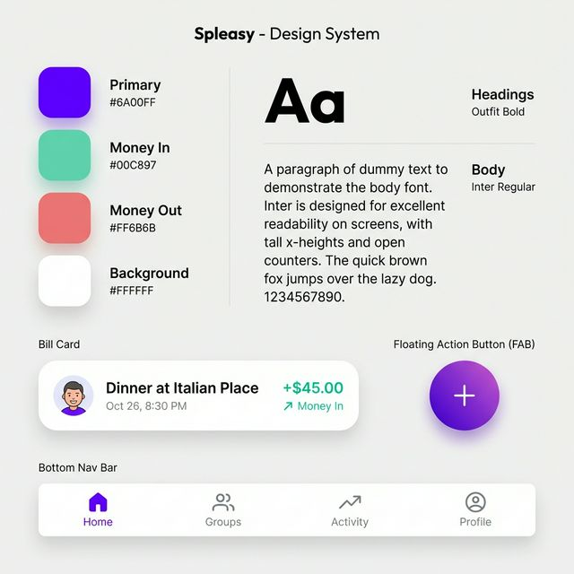

# Start of Design System Proposal: "Spleasy Modern"



## 1. Design Philosophy
**"Clarity in Complexity"**
Splitting bills can be stressful and complex. The design should act as a calming, clarifying agent.
- **Modern**: Uses current UI trends (bento-grids, large typography, smooth motion).
- **Minimalist**: "Less is more". Only show what's needed. reducing cognitive load.
- **Mobile First**: All interactions are designed for thumb-reach. Navigation is bottom-heavy.

## 2. Visual Foundation

### Typography
We will move to a pairing that balances functionality with friendliness.
- **Headings**: **[Outfit](https://fonts.google.com/specimen/Outfit)** or **[Plus Jakarta Sans](https://fonts.google.com/specimen/Plus+Jakarta+Sans)**.
  - *Why*: Geometric, modern, friendly. High legibility at large sizes.
- **Body**: **[Inter](https://fonts.google.com/specimen/Inter)** (Existing) or **[Satoshi](https://www.fontshare.com/fonts/satoshi)**.
  - *Why*: Unmatched legibility for numbers and small text.

**Scale (Mobile First):**
- `h1`: 32px (Bold) - Page Titles
- `h2`: 24px (SemiBold) - Section Headers
- `h3`: 20px (Medium) - Card Titles
- `body`: 16px (Regular) - Default
- `small`: 14px (Medium) - Metadata/Secondary

### Color Palette (The "Calm Split")
Refining the existing Violet/Zinc scheme to be softer and more modern using OKLCH.

**Base Variables**
- **Primary**: `oklch(0.58 0.20 280)` (Vibrant Violet) -> Used for primary actions, distinct brand moments.
- **Background**: `oklch(0.99 0 0)` (Pure White) -> `oklch(0.98 0.01 280)` (Tinted White) for ease on eyes.
- **Surface/Card**: `oklch(1 0 0)` (White) on Light Gray bg, or `oklch(0.18 0.02 280)` (Dark Grey) on Dark.

**Semantic Colors (The Money Logic)**
Crucial for a bill splitter.
- **Positive (You are owed)**: **Teal/Mint** `oklch(0.7 0.14 160)`.
  - *Vibe*: "Money is coming, relax." Avoid aggressive neon greens.
- **Negative (You owe)**: **Rose/Coral** `oklch(0.65 0.18 15)`.
  - *Vibe*: "Action needed, but don't panic." Avoid pure alarmist red.
- **Neutral (Settled)**: **Slate** `oklch(0.6 0.04 260)`.

### Icons
**Lucide React** (Existing).
- Use `stroke-width={1.5}` for a thinner, lighter, elegant look.
- Use `stroke-width={2}` only for active states.

### Radius & Spacing
- **Radius**: Increase from `0.625rem` (10px) to `1rem` (16px) or `1.5rem` (24px) for cards.
  - *Why*: Friendlier, more modern "app-like" feel.
- **Spacing**: 4px grid base.
  - Standard padding: `16px` (mobile edge), `20px` (card content).

## 3. UI Components & Patterns

### 1. The "Bill Card" (Core Component)
Instead of a simple list, use cards implementation.
- **Appearance**: Flat background (Light Gray/Surface), no shadow, subtle border `border-border/50`.
- **Interaction**: Tap to expand details. Swipe actions (Settle/Remind).

### 2. Bottom Navigation (Mobile First)
Abandon top nav for functional actions.
- **Fab (Floating Action Button)**: Centered "Add Expense" button. Large, gradient violet.
- **Tabs**: "Groups", "Friends", "Activity", "Account".

### 3. "Bento" Dashboard
Use a bento-grid style dashboard for the home screen.
- Large block: "Total Balance" (Net position).
- Medium block: "Recent Split" (Quick access).
- Small blocks: "Pending Requests".

### 4. Input Experience
- **Big Money Input**: When entering amounts, the font size should be HUGE (e.g., 48px).
- **Clean Forms**: Remove input borders, use bottom lines or just backgrounds (`bg-muted/50`). Focus states use a subtle ring.

## 4. Implementation Steps
1. **Theme Update**: existing `globals.css` update with new OKLCH values.
2. **Font Install**: Add `Outfit` alongside `Inter`.
3. **Component Refactor**: Update `shadcn` components (`card`, `button`, `input`) to match new radius and border styles.
4. **Layout Shift**: Implement Bottom Navigation layout wrapper.

---

## 5. Example Tailwind Config Additions

```ts
// Semantic colors extension
extend: {
  colors: {
    money: {
      in: "oklch(var(--money-in) / <alpha-value>)",   // Teal
      out: "oklch(var(--money-out) / <alpha-value>)", // Rose
      settled: "oklch(var(--money-settled) / <alpha-value>)",
    }
  },
  borderRadius: {
    '4xl': '2rem', // for big cards
  }
}
```

## 6. UX Core Principles & References

### Core Experience Principles
1.  **The "5-Second Rule"**: Adding a simple expense (Who, What, How Much) must be achievable in under 5 seconds from app launch.
2.  **Zero-Ambiguity Math**: Users should never have to guess *why* they owe an amount. "Show the work" in a collapsed view.
3.  **Social but Transactional**: It's money between friends. The language should be polite ("Remind" vs "Pay me"), but the math must be cold and precise.
4.  **Thumb-Zone Navigation**: 90% of core actions (Add, Settle, View) must be in the bottom 40% of the screen.

### UX References & Inspiration
-   **Splitwise**: *The Logic Standard*. We mimic their robust splitting math (unequal splits, shares) but aim to improve their visual clutter.
-   **Cash App / Venmo**: *The Social Standard*. We borrow their "feed" aesthetic and the simplicity of the large-text money input.
-   **Revolut / Monzo**: *The Clarity Standard*. We adopt their use of merchant icons and clean lists to make spending history scannable.
-   **Arc Search / Linear**: *The Interaction Standard*. We aim for their fluid motion and haptic feedback when interacting with lists.
