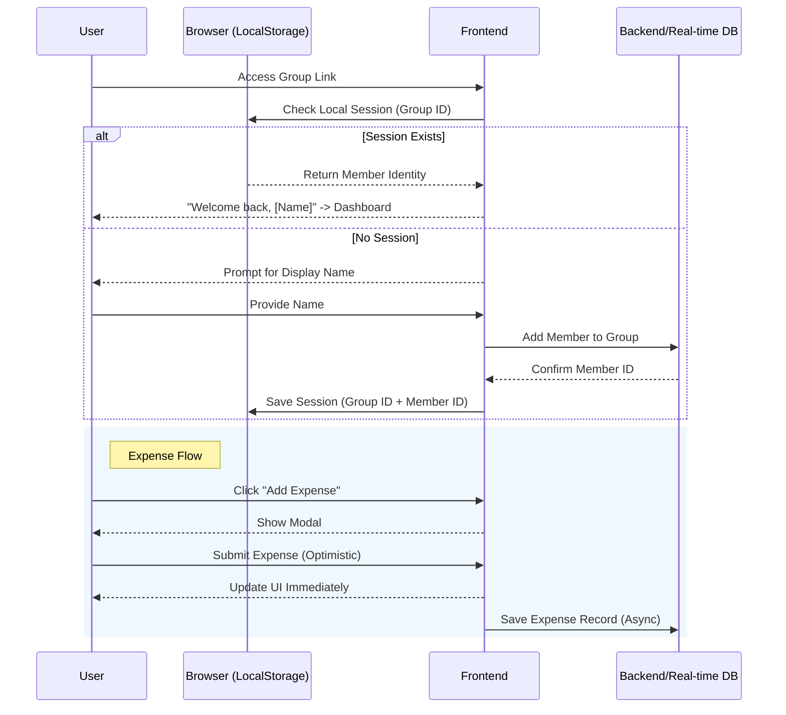

# Spleasy - Functional Flow & Screen Specification (MVP)

This document outlines the user flows, screen requirements, and logical sequences for the Spleasy bill-splitting application, designed with a mobile-first approach.

## 1. Global UX Principles (New)

*   **Optimistic UI:** All creative actions (add expense, create group) must update the UI immediately. Background sync handles simple failures (retry) without blocking the user.
*   **Haptic Feedback (Mobile):** Use `navigator.vibrate` for critical confirmations (e.g., successful expense addition, reaching 0 balance).
*   **PWA Ready:** Manifest and Service Workers to support "Add to Home Screen".
*   **Smart Defaults:** 
    *   Currency defaults to user's locale (likely VND).
    *   "Paid By" defaults to current user.
    *   "Split With" defaults to "All".
*   **Visual Clarity:** Use Avatars (Initials + Color) to represent users instead of just text names.
*   **Space Efficiency (Mobile):** Top headers and widgets must be compact or collapsible to maximize screen real estate for content (lists).

## 1.1 Design System Standards (Critical)
*   **Primary Color:** **Electric Indigo** (Hue 276).
    *   **Value:** `oklch(0.55 0.22 276.0)`
    *   **Usage:** Buttons, Active States, Links, Brand Elements.
    *   **Rationale:** Balances "Trust" (Financial) with "Energy" (Modern App).
    *   **Prohibition:** Do not use generic Blue or purple-heavy Violet (Hue > 280).
*   **Typography:** Inter (Sans-serif) for UI, `tabular-nums` for all currency data.
*   **Radii:** `rounded-xl` or `rounded-2xl` for cards, `rounded-full` for buttons.

## 2. Core User Flows

### 2.1. Unified App Entry Logic (S2)
1.  **Entry Point**: User accesses `/app`.
2.  **Display**: **Unified Entry Screen**.
3.  **Modes**:
    *   **Create Group Mode**:
        *   **Inputs**: User Name (Mandatory), Group Name (Optional).
        *   **Action**: Generates Group (PIN, ID, Defaults) -> Redirect to Dashboard.
    *   **Join Group Mode**:
        *   **Inputs**: Group PIN (6 digits), User Name.
        *   **Action**: Validates PIN -> Updates LocalStorage -> Redirect to Dashboard.

### 2.2. Intelligent Routing Scenarios

#### Scenario A: Direct Access (Create/Join)
1.  **Action**: User visits `spleasy.app/app`.
2.  **UI**: User sees tabs/options for "Create" or "Join".
3.  **Create Flow**: Enters Name -> Submit -> New Group created.
4.  **Join Flow**: Enters PIN + Name -> Submit -> Deployed to Group.

#### Scenario B: Shared Link Access
1.  **Action**: User clicks `spleasy.app/app/group/<group-id>` (or similar deep link).
2.  **Check LocalStorage**:
    *   **Exists**: If user already has session for this Group ID -> **Immediate Redirect to Dashboard**.
    *   **New/Anonymous**: Redirect to **App Entry (Join Mode)**.
3.  **App Entry State**:
    *   **PIN/Group**: Pre-filled/Resolved from URL.
    *   **Validation**: Check if Group exists in DB.
        *   **Found**: Show Join Form (PIN filled, ask for Name).
        *   **Not Found**: Show "Group not exist" error -> Reset to blank Join form.
4.  **Completion**: User enters Name -> Joins -> LocalStorage Updated -> Dashboard.

### 2.3. Adding an Expense
1. **Action**: Any member clicks "Add Expense" FAB.
2. **Input**:
    - **Amount**: Custom numeric keypad (Mobile) or focused input.
    - **Description**: Short text (e.g., "Dinner").
    - **Payer**: Select Avatar (defaults to current user).
    - **Split With**: Tap Avatars to toggle (defaults to "Select All").
3. **Logic**: System calculates `Amount / Number of Selected Members`.
4. **Result**: Expense is added to the "Activity Log", and "Net Balances" are updated immediately.

### 2.4. Settle Up (Debt Repayment)
1. **Context**: User A owes User B.
2. **Action**: User clicks on a specific debt line in "Balances" tab OR "Settle Up" button.
3. **Input**: 
    - **Payer (From)**: Defaults to User A.
    - **Receiver (To)**: Defaults to User B.
    - **Amount**: Defaults to total debt amount (editable).
4. **Logic**: Records a special "Reimbursement" transaction.
5. **Result**: Updates balances (A owes B less or zero).

---

## 3. Mermaid Sequence Diagram: Adding an Expense

---

## 4. Screen Requirements

### S1: Landing / Home Screen (Completed)
*   **Status**: **Implemented**.
*   **Purpose**: Marketing and Entry point.
*   **Action**: "Get Started" / "Launch App" button redirects to Unified App Entry (S2).

### S2: App Entry / Onboarding Screen (Unified)
*   **Purpose**: Single screen handling both creation and joining.
*   **Design**: Mobile-optimized, possibly Tab View (Create | Join) or Flip Animation.
*   **Create Form**:
    *   **User Name** (Required, Focus).
    *   **Group Name** (Optional, placeholder "e.g., Weekend Trip").
    *   **"Start Spleasing"** Button.
*   **Join Form**:
    *   **Group PIN** (6-digit, required).
    *   **User Name** (Required).
    *   **"Join Group"** Button.
*   **Behavior (Link Follow)**:
    *   If coming from valid link -> Auto-switch to **Join Form** with PIN filled.
    *   If link invalid -> Error toast "Group not found", stay on normal Join form.
*   **Post-Action**:
    *   On Success: Save `{ groupId, userName }` to `spleasy_session` in LocalStorage.
    *   Redirect to **S3 Dashboard**.

#### UI/UX Design Notes (S2)
*   **Component Usage**:
    *   **Tabs**: Use `Tabs` component for "Create" vs "Join" switch.
    *   **Inputs**: Large, borderless or bottom-border inputs (`Input` variant "flushed") to feel conversational.
    *   **Buttons**: `Button` size="lg", rounded="full". Primary color (Indigo).
*   **Mobile Rule**:
    *   Place the primary action button ("Start" / "Join") at the **bottom of the viewport** (using `fixed bottom-4 left-4 right-4`) to be thumb-reachable.
    *   Use `AnimatePresence` for smooth cross-fade between Create/Join forms.

### S3: Group Dashboard (Main)
*   **Purpose**: Central hub. Contains Activity, Balances, and Settings.
*   **Elements**:
*   **Elements**:
    *   **Header**: Compact Group Name + "Share" icon (Quick Action).
    *   **Stats Widget**:
        *   **Collapsible/Compact**: When "Activity" tab is active, this widget shrinks or hides to show more expenses.
        *   **Expanded**: Shows full details in "Balances" tab.
    *   **Tabs**:
        1.  **Activity**: List of expense cards.
            *   **Card Details**: Description, Amount, Payer, Split With, Date/Time. (No detailed view, so all info must be visible).
        2.  **Balances**: Visual Debt bar charts + "Settle Up" actions.
        3.  **Settings**:
            *   **Share Section**: Large Link & QR Code (Prominent).
            *   **Members**: List of members (Edit/Remove).
            *   **Preferences**: Currency, Rename Group.
    *   **Floating Action Button (FAB)**: "+" icon (Primary color).

*   **Behavior**:
    *   New Group Creation redirects here with "Settings" tab active (or "Share" sheet open).

#### UI/UX Design Notes (S3)
*   **Component Usage**:
    *   **Navigation**: Custom **Bottom Navigation Bar** (fixed). Use `Lucide` icons (Home, Activity, Settings).
    *   **Cards**: Expenses displayed in `Card` components with `shadow-sm` and `bg-card`.
    *   **Stats**: Use `Collapsible` for the top Stats widget.
*   **Mobile Rule**:
    *   **Header**: Minimal height (`h-14`). "Group Name" truncated with ellipsis if too long.
    *   **List View**: Infinite scroll for Activity.
    *   **FAB**: Floating Action Button for "Add Expense" must float above the Bottom Bar, centered or bottom-right.
    *   **Typography**: Use `tabular-nums` for all currency display to ensure vertical alignment in lists.

### S5: Add Expense Screen (Modal/Full Screen)
*   **Purpose**: Data entry loop.
*   **Elements**:
    *   **Step 1: Amount**: Large numeric display. Custom Keypad with shortcuts (+000, +k).
    *   **Step 2: Details**:
        *   **Description**: Short text (e.g., "Dinner").
        *   **Payer**: Horizontal scroll of Avatars.
        *   **Split With**: "Select All" toggle + Grid of Member Avatars (tap to uncheck).
    *   **"Save" Button**: Full width.

#### UI/UX Design Notes (S5)
*   **Component Usage**:
    *   **Modal**: Use `Drawer` (Bottom Sheet) from shadcn/ui for mobile, `Dialog` for desktop.
    *   **Amount Input**: Massive font size (`text-5xl`), centered, caret-color-primary.
    *   **Avatars**: Use `Avatar` with fallback initials. Selected state indicated by `ring-2 ring-primary`.
*   **Mobile Rule**:
    *   **Keypad**: Custom numeric keypad (CSS Grid) is preferred over native keyboard to prevent layout shifting/keyboard popping issues.
    *   **Haptics**: Trigger `navigator.vibrate(10)` on keypad taps.
    *   **Close Action**: Drag-down to close (standard Sheet behavior).

---

## 5. Mobile vs. Web Compatibility

| Feature | Mobile Version (Priority) | Web/Desktop Version |
| :--- | :--- | :--- |
| **Navigation** | Bottom Tab Bar (Activity/Balances). | Top Right Nav Links. |
| **Input** | Custom numeric keypad. | Standard keyboard input. |
| **Sharing** | Native "Share" sheet. | "Copy Link" / QR Code. |
| **Forms** | Full-screen modals/Sheets. | Centered dialog modals. |
| **Haptics** | Vibration on success. | Visual success toasts. |
