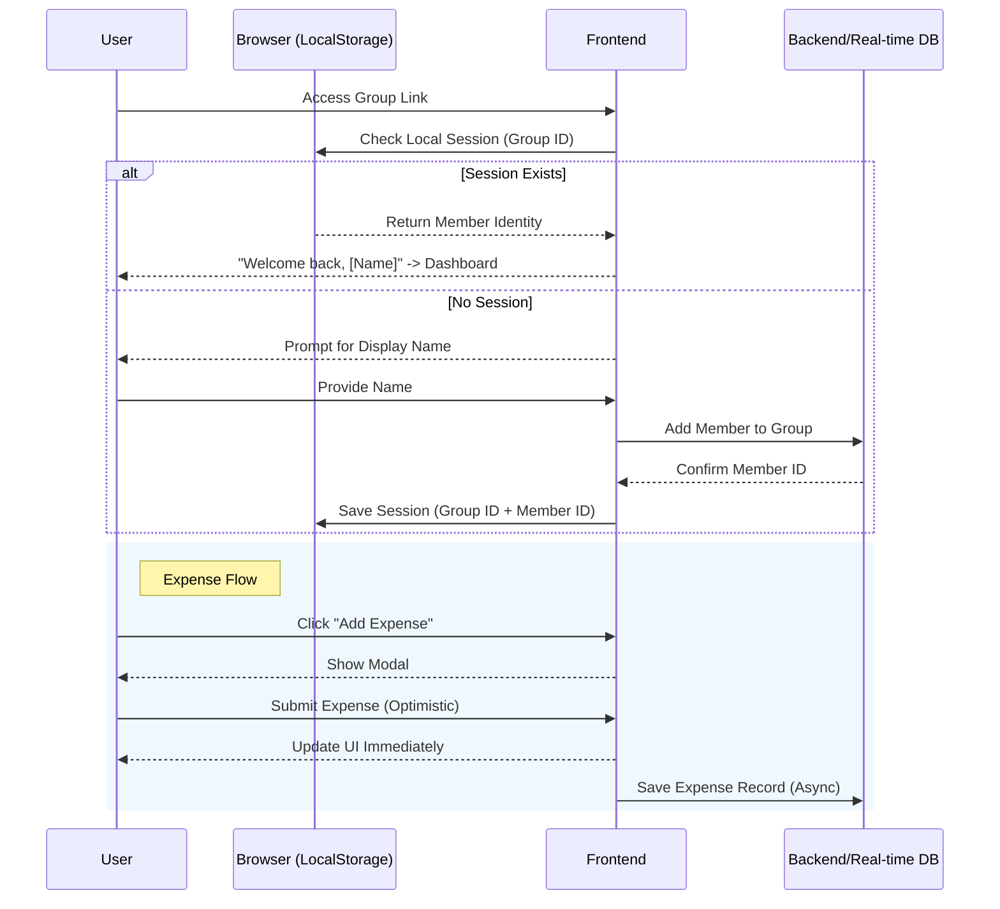

# Spleasy - Functional Flow & Screen Specification (MVP)

This document outlines the user flows, screen requirements, and logical sequences for the Spleasy bill-splitting application, designed with a mobile-first approach.

## 1. Global UX Principles (New)

*   **Optimistic UI:** All creative actions (add expense, create group) must update the UI immediately. Background sync handles simple failures (retry) without blocking the user.
*   **Haptic Feedback (Mobile):** Use `navigator.vibrate` for critical confirmations (e.g., successful expense addition, reaching 0 balance).
*   **PWA Ready:** Manifest and Service Workers to support "Add to Home Screen".
*   **Smart Defaults:** 
    *   Currency defaults to user's locale (likely VND).
    *   "Paid By" defaults to current user.
    *   "Split With" defaults to "All".
*   **Visual Clarity:** Use Avatars (Initials + Color) to represent users instead of just text names.

## 2. Core User Flows

### 2.1. Unified App Entry Logic
1.  **Entry Point**: User accesses `/app` (either directly or via "Create/Join" from Landing).
2.  **Display**: Shows the **App Entry Screen (S2)**.
3.  **State**:
    *   **Default**: User sees two large options: "Create Group" and "Join Group".
    *   **Create Mode**: If "Create" is selected (or passed via query param), show Group Name input.
    *   **Join Mode**: If "Join" is selected (or passed via query param), show Group ID input.

### 2.2. Intelligent Routing Scenarios

#### Scenario A: Direct Access & Landing Page Handoff
1.  **Action**: User visits `spleasy.app/app` OR clicks "Create/Join" on Landing Page.
2.  **Routing**: 
    *   If "Create" clicked -> `spleasy.app/app?mode=create` -> **App Entry (Create Mode)**.
    *   If "Join" clicked -> `spleasy.app/app?mode=join` -> **App Entry (Join Mode)**.
3.  **Completion (Create)**:
    *   User enters Group Name -> Submits.
    *   **Result**: Redirects to **Group Dashboard (Settings Tab)** to encourage sharing.
4.  **Completion (Join)**:
    *   User enters Code -> Submits -> Redirects to **Group Dashboard**.

#### Scenario B: Joined via Shared Link
1.  **Action**: User clicks `spleasy.app/app/group/<group-id>`.
2.  **Check Session**: System checks if user is already a member.
    *   **Match Found**: Redirect straight to **Group Dashboard**.
    *   **No Match**: Redirect to **App Entry (Join Mode)**.
3.  **State Pre-fill**:
    *   **Group ID**: Pre-filled and read-only (or editable if user wants to switch).
    *   **Focus**: Cursor automatically focuses on "Display Name" input.
4.  **Result**: User enters name -> Joins -> Redirects to **Group Dashboard**.

### 2.3. Adding an Expense
1. **Action**: Any member clicks "Add Expense" FAB.
2. **Input**:
    - **Amount**: Custom numeric keypad (Mobile) or focused input.
    - **Category**: Select Icon (Food, Transport, Lodging, Ent, Groceries, Other).
    - **Description**: Short text (e.g., "Dinner").
    - **Payer**: Select Avatar (defaults to current user).
    - **Split With**: Tap Avatars to toggle (defaults to "Select All").
3. **Logic**: System calculates `Amount / Number of Selected Members`.
4. **Result**: Expense is added to the "Activity Log", and "Net Balances" are updated immediately.

### 2.4. Settle Up (Debt Repayment)
1. **Context**: User A owes User B.
2. **Action**: User clicks on a specific debt line in "Balances" tab OR "Settle Up" button.
3. **Input**: 
    - **Payer (From)**: Defaults to User A.
    - **Receiver (To)**: Defaults to User B.
    - **Amount**: Defaults to total debt amount (editable).
4. **Logic**: Records a special "Reimbursement" transaction.
5. **Result**: Updates balances (A owes B less or zero).

---

## 3. Mermaid Sequence Diagram: Adding an Expense

---

## 4. Screen Requirements

### S1: Landing / Home Screen
*   **Purpose**: Return hub and entry point.
*   **Elements**:
    *   **Hero**: "Split bills instantly."
    *   **Recent Groups (New)**: Horizontal scroll of cards for groups visited recently (stored in `LocalStorage`). shows: Group Name, "Last viewed 2m ago".
    *   **Primary Actions**:
        *   "Create Group" (Prominent).
        *   "Join Group" (Secondary).

### S2: App Entry / Onboarding Screen (Unified)
*   **Purpose**: Single entry point handling creation, manual joining, and link onboarding.
*   **Design**: Clean, focused interface. Uses a "Card" or "bottom sheet" style on mobile.
*   **States**:
    1.  **Selection State**: Two large cards/buttons: "New Group" vs "Join Existing".
    2.  **Create State**:
        *   Input: Group Name (Auto-focus).
        *   "Create" Button.
        *   "Cancel/Back" Button.
    3.  **Join State**:
        *   Input: Group ID (Pre-filled if via link).
        *   Input: Display Name (Required).
        *   "Join" Button.
*   **Behavior**: Smooth transitions between states without reloading.

### S3: Group Dashboard (Main)
*   **Purpose**: Central hub. Contains Activity, Balances, and Settings.
*   **Elements**:
    *   **Header**: Group Name + "Share" icon (Quick Action).
    *   **Stats Widget**: Sticky summary (Total Group Spend | Your Position).
    *   **Tabs**:
        1.  **Activity**: List of expense cards.
        2.  **Balances**: Visual Debt bar charts + "Settle Up" actions.
        3.  **Settings**:
            *   **Share Section**: Large Link & QR Code (Prominent).
            *   **Members**: List of members (Edit/Remove).
            *   **Preferences**: Currency, Rename Group.
    *   **Floating Action Button (FAB)**: "+" icon (Primary color).

*   **Behavior**:
    *   New Group Creation redirects here with "Settings" tab active (or "Share" sheet open).

### S5: Add Expense Screen (Modal/Full Screen)
*   **Purpose**: Data entry loop.
*   **Elements**:
    *   **Step 1: Amount**: Large numeric display. Custom Keypad with shortcuts (+000, +k).
    *   **Step 2: Details**:
        *   **Category Grid**: 6-8 icons.
        *   **Description**: Auto-suggest based on category (e.g., Food -> "Dinner").
        *   **Payer**: Horizontal scroll of Avatars.
        *   **Split With**: "Select All" toggle + Grid of Member Avatars (tap to uncheck).
    *   **"Save" Button**: Full width.

---

## 5. Mobile vs. Web Compatibility

| Feature | Mobile Version (Priority) | Web/Desktop Version |
| :--- | :--- | :--- |
| **Navigation** | Bottom Tab Bar (Activity/Balances). | Top Right Nav Links. |
| **Input** | Custom numeric keypad. | Standard keyboard input. |
| **Sharing** | Native "Share" sheet. | "Copy Link" / QR Code. |
| **Forms** | Full-screen modals/Sheets. | Centered dialog modals. |
| **Haptics** | Vibration on success. | Visual success toasts. |
